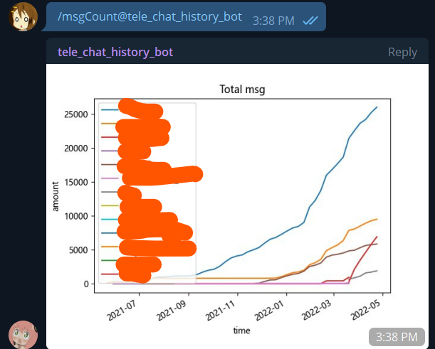
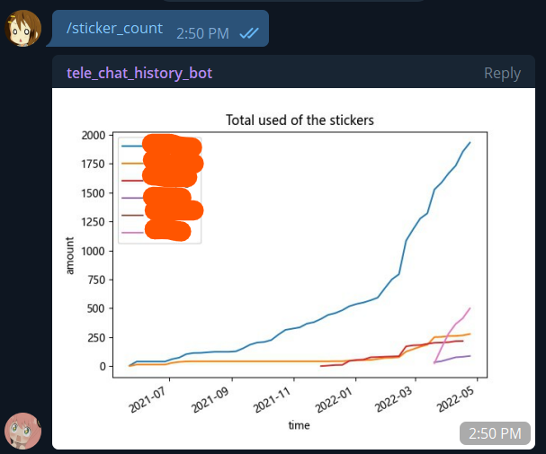
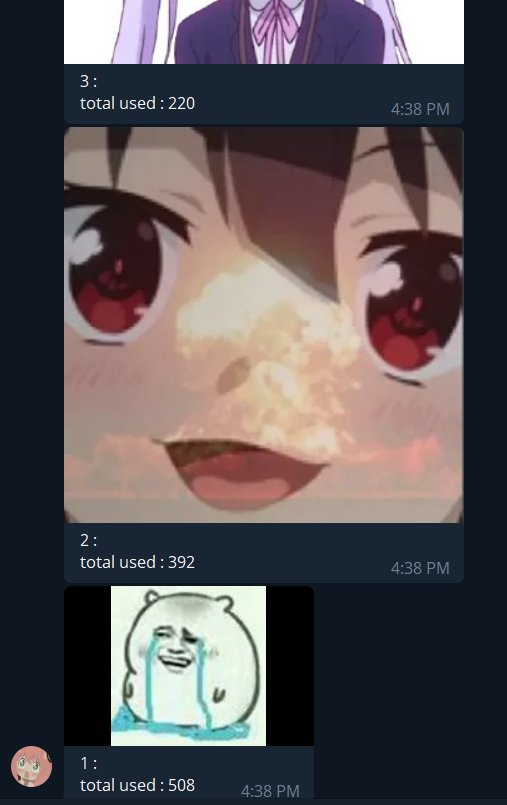
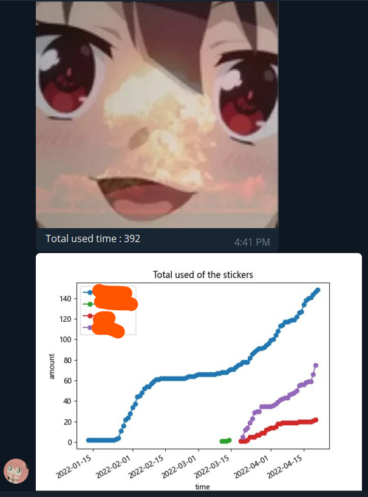
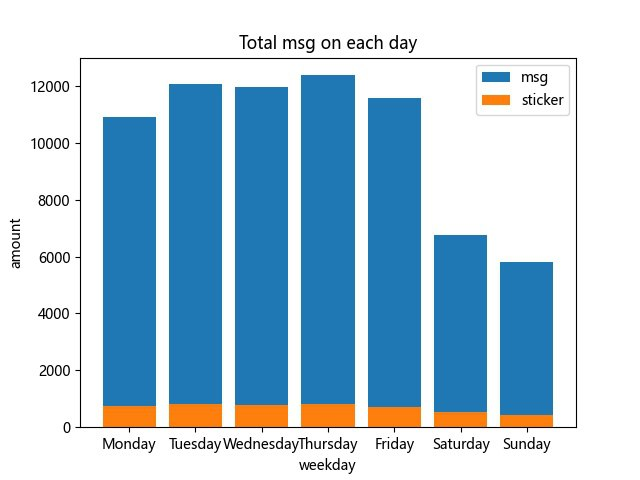
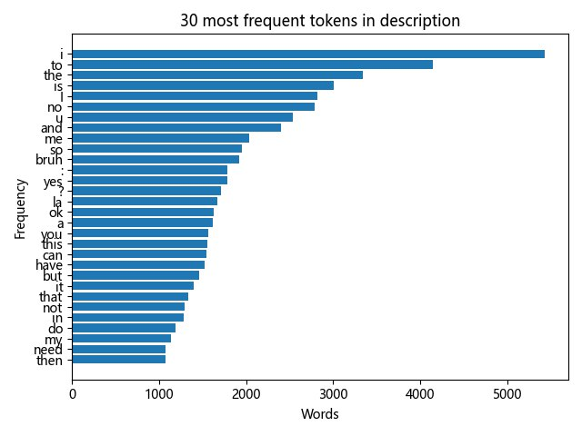

# tele_chat_history_Bot #

## Telegram chat history statistic in telegram bot ##

 

[bot invite link](https://t.me/tele_chat_history_bot)

## set up ##
1. ```pip install -r requirements.txt```
2. ```python main.py```

## how to use the bot ##
### 1. Download the telegram chat history (json format!)###
### 2. Rename folder name to data ###
### 3. Compressed the folder to zip file ###
### 4. Type ```/upload ``` cmd on telegram bot ###
### 5. Upload the zip file ###
### 6. Use the cmd on that group ###
### 7. Remove the data by typing ```/remove``` if u want 

## Command available: ##
- /help - show this msg
- /start - show this msg
- /upload - upload zip file
- /remove - remove folder 
- /word - word count
- /msgCount - message count

- /stickerCount - sticker count

- /sticker - sticker ranking

- /check - specific sticker count

- /dayCount - msg count on each weekday

- /wordCloud - create a wordCloud

- /freq - show most frequent words


## Credit ##
- [rain2wood](https://github.com/rain2wood) for giving suggestion and inspiration
- [CCN0807](https://github.com/CCN0807) for giving suggestion and inspiration
- [telebot](https://github.com/eternnoir) for using the api service


